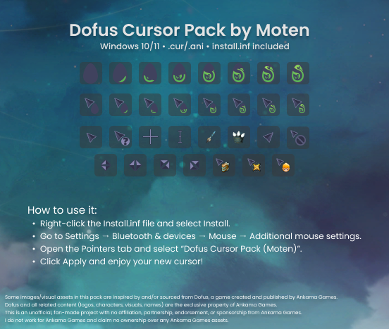
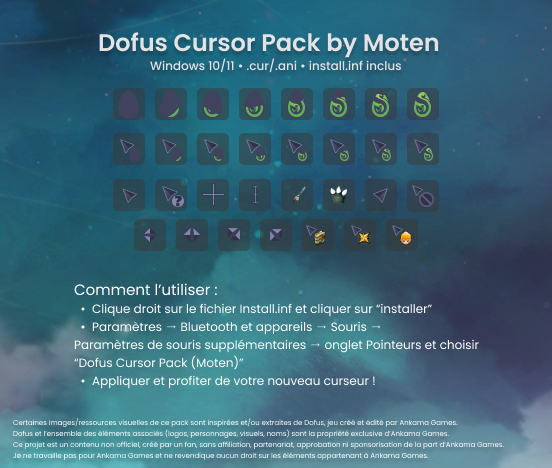

# Dofus Cursor Pack (by Moten)

Custom Windows cursor scheme inspired by *Dofus*.

- **OS:** Windows 10 / 11  
- **Formats:** `.cur` (static) + `.ani` (animated)  
- **Install:** `install.inf` (right-click → Install)

## Preview

---

## 🇫🇷 Installation (Windows 10/11)

1. Télécharge le `.zip` du pack (via **Releases**) et dézippe-le.
2. Vérifie que `install.inf` est au même niveau que les fichiers `.cur` / `.ani` (pas dans un sous-dossier).
3. Clic droit sur `install.inf` → **Installer**.
4. Va dans : **Paramètres → Bluetooth et appareils → Souris → Paramètres de souris supplémentaires**.
5. Onglet **Pointeurs** → **Schéma** : sélectionne **Dofus Cursor Pack (Moten)**.
6. **Appliquer** → **OK**.

### Dépannage
- Pas d’option **Installer** : le fichier est peut-être `install.inf.txt` (affiche les extensions).
- Certaines applis ne changent pas : elles utilisent leurs propres curseurs.

---

## 🇬🇧 Installation (Windows 10/11)

1. Download the pack `.zip` (from **Releases**) and extract it.
2. Make sure `install.inf` is next to the `.cur` / `.ani` files (not inside a subfolder).
3. Right-click `install.inf` → **Install**.
4. Open: **Settings → Bluetooth & devices → Mouse → Additional mouse settings**.
5. **Pointers** tab → **Scheme**: select **Dofus Cursor Pack (Moten)**.
6. Click **Apply** → **OK**.

### Troubleshooting
- No **Install** option: the file may be `install.inf.txt` (enable file extensions).
- Some apps won’t change: they ship their own cursors.

---

## Legal / Credits

Some images/visual assets in this pack are inspired by and/or sourced from *Dofus*, a game created and published by **Ankama Games**. *Dofus* and all related content (logos, characters, visuals, names) are the exclusive property of **Ankama Games**.

This is an **unofficial**, fan-made project with **no affiliation, partnership, endorsement, or sponsorship** from Ankama Games. I **do not work** for Ankama Games and **claim no ownership** over any Ankama Games assets.
